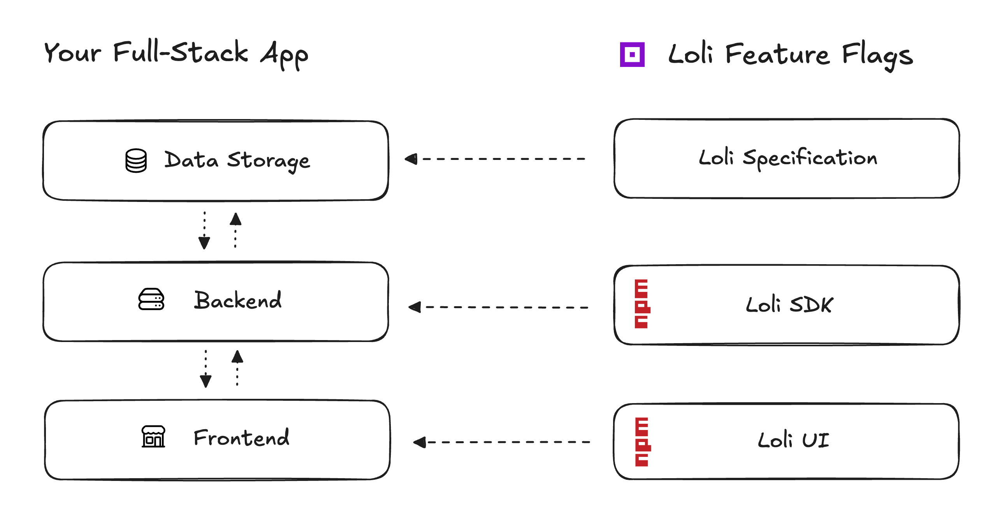

# Introduction

Loli Feature Flags is built around the core concept, that **you are able to own and control everything**.

It is a toolkit that enables you to **build your own feature flag tooling**
on top of your existing hardware and data storage.

Keep the costs very low. No third party services included. Own your feature flag specification.

Right now, Loli Feature Flags supports JavaScript and TypeScript apps.

## Novel Approach

Loli Feature Flags has a novel approach. Instead of copying feature flag tooling that is available on the market
(paid tools as well as free tools), Loli introduces a new approach.

Existing solutions usually include an external service with its own database, evaluation API and some
client libraries that connect to the external service. This is the same for paid and free/open source tools.

**Loli Feature Flags on the other hand gives you the building blocks to integrate a full-fledged feature flag tooling
into your existing stack.**

## How It Works

Loli Feature Flags offers some packages you can use in your applications. You basically need the following things:
- A data storage where the Loli specification can be stored.
- Some compute resources where you can evaluate feature flags (e.g. your backend) using the Loli SDK.
- A frontend only accessible to you where you can integrate Loli UI which lets you manage feature flags.

### Loli Specification

A Loli specification is a JSON file. It describes your feature flag setup. This includes:
- Feature flags, their output value data types, their status, and all targeting rules.
- Segments that act as "reusable conditions" with their targeting rules.
- Evaluation context attributes (essentially user attributes), their data types, and location.

One Loli specification describes one complete feature flag setup. You can store such a JSON Loli specification
in nearly any data storage:
- Relational databases with native JSON support (Postgres, MySQL, MariaDB, SQL Server, Oracle Database, etc.).
- Relational databases without native JSON support as text/LOB (SQLite, older versions of other RDBMS).
- NoSQL databases (MongoDB, Firestore, CouchDB, DynamoDB, Redis, Valkey, etc.).
- File storages/buckets as JSON files (AWS S3, MinIO, Azure Blob Storage, etc.).
- CDN/edge storages (Vercel Edge Config, etc.).

You can learn more about the specification here: [Specification Reference Docs]

### Loli SDK

The [Loli SDK](../../reference/sdk/index.md) (Software Development Kit) offers functions to work with and evaluate feature flags defined in a
Loli specification.

The core piece is the [Loli Client](../../reference/sdk/client/index.md) which loads a stored Loli specification
and lets you evaluate all or single feature flags based on user data.

The SDK can be used by your backend/API to evaluate feature flags for server-side logic or to send the feature flag
values to a client.

But it can also be used on the client-side for [Client Side Evaluation](../../reference/sdk/architectures/client-side-evaluation.md)
(although not recommend).

### Loli UI

The [Loli UI](../../reference/ui/index.md) is a pluggable user interface/visual editor that can be injected
into any website/web-app. It provides a visual way to manage feature flags.

This avoids managing/creating a Loli specification by hand.

## When To Use

You should use Loli Feature Flags if you want some of the following things:
- Low costs. Loli Feature Flags is a free open-source toolkit and lets you reuse existing resources.
- Full ownership. There are no third party services you need to rely on.
- Data privacy. You own the Loli specification, all the data, and can precisely control where data is transferred to and processed.
- Availability first. Rely on your infrastructure. Plus, the emergency mode got you covered in case your data storage is not accessible.
- Robust and type-safe feature flag specification.
- Advanced features such as targeting, gradual rollouts, A/B-testing, and more.
- Easy to use visual editor to let also non-technical people manage feature flags.
- Open source and MIT-License software.

## Further Reads

- [Getting Started](./getting-started.md)
- [Features](./features.md)
- [Best Practices](./best-practices.md)
- [Terminology](./terminology.md)
- [Resources](./resources)
- [Kudos](./kudos.md)
